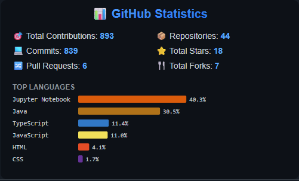

# 📊 GitHub Stats Generator

Automatically generate and display your GitHub statistics as a beautiful SVG badge.



## ✨ Features

- 📈 Total contributions, commits, and pull requests
- 📦 Repository count with stars and forks
- 💻 Top 6 programming languages with percentages
- 🎨 Beautiful dark-themed SVG design
- 🔄 Auto-updates daily via GitHub Actions

## 🚀 Setup

### 1. Fork this repository

Click the "Fork" button at the top right of this page.

### 2. Create a Personal Access Token

1. Go to [GitHub Settings → Developer settings → Personal access tokens → Tokens (classic)](https://github.com/settings/tokens)
2. Click "Generate new token (classic)"
3. Give it a name like "GitHub Stats"
4. Select the following scopes:
    - `repo` (all)
    - `read:user`
5. Click "Generate token" and copy it

### 3. Add the token to your repository

1. Go to your forked repository
2. Click on **Settings** → **Secrets and variables** → **Actions**
3. Click "New repository secret"
4. Name: `ACCESS_TOKEN`
5. Value: Paste your token
6. Click "Add secret"

### 4. Enable GitHub Actions

1. Go to the **Actions** tab in your repository
2. Click "I understand my workflows, go ahead and enable them"

### 5. Run the workflow manually (first time)

1. Go to **Actions** → **Generate GitHub Stats**
2. Click "Run workflow" → "Run workflow"
3. Wait for it to complete (about 30 seconds)

## 📊 Usage

Once set up, your stats will automatically update daily at midnight UTC. You can also trigger updates manually from the Actions tab.

### Display in your profile README

Add this to your GitHub profile README:

```markdown

```

Replace `YOUR_USERNAME` and `REPO_NAME` with your details.

## 🔧 Manual Update

To update stats manually:

1. Go to **Actions** tab
2. Select "Generate GitHub Stats"
3. Click "Run workflow"

## 📁 Output Files

- `stats.svg` - Visual statistics badge
- `stats.json` - Raw JSON data

## 🛠️ Built With

- Go 1.21
- GitHub GraphQL API
- GitHub Actions

---

⭐ If you found this useful, consider giving it a star!